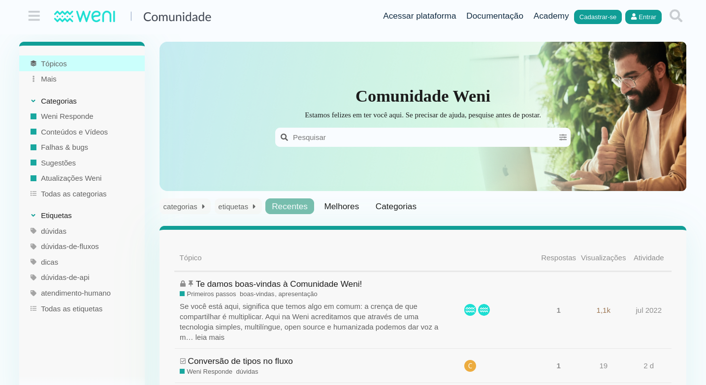

# Community

At Weni, we believe that through simple, multilingual, open-source, and human-centered technology, we can give a voice to thousands of people. That’s why we see our community as a collaborative way to democratize information. In this space, the Weni Platform will be continuously improved. Thanks to the contributions of different developers and their innovative ideas, we will be able to:

- [x] Enhance solutions
- [x] Implement new features
- [x] Solve problems
- [x] Connect people

Thank you for being here and for helping us unlock human potential more and more. Feel free to contribute with your questions and suggestions.This is the right place to gain more experience and knowledge.

[Engage with the Weni community](https://comunidade.weni.ai/){ .md-button .md-button--primary }