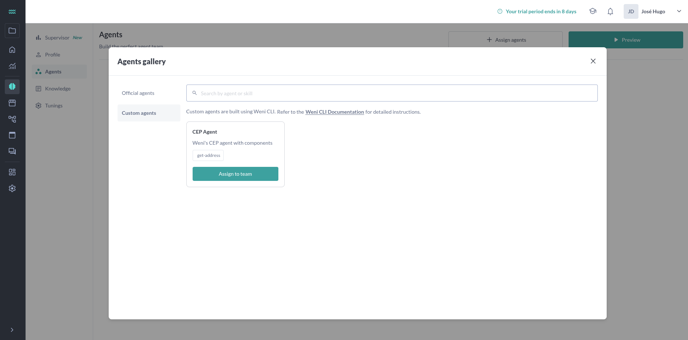
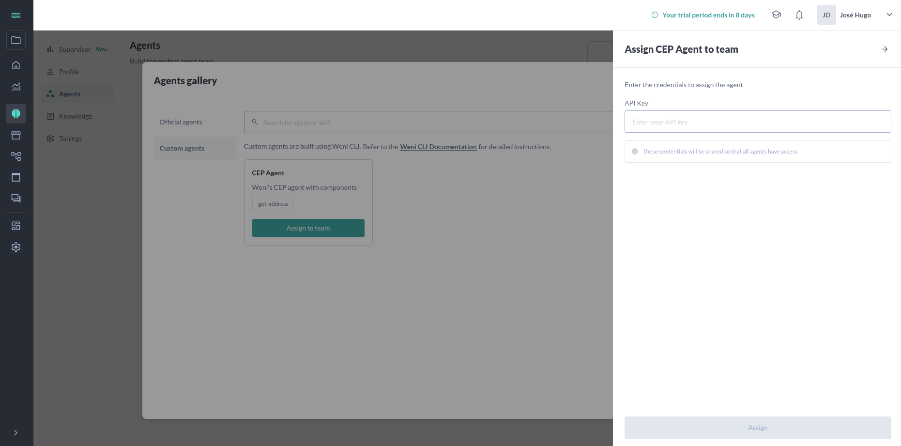

# Credentials

Credentials are confidential information that your agents can use when invoking a specific skill. To fully understand how to incorporate credentials into your agents, we recommend reading this entire content and the following complementary resources: [Agents](./agents.md) and [Skills](./skills.md).

Credentials are extremely important at two stages of your agents' development cycle:

- [x] For local testing of skills during development
- [x] For your agent to be used in production on channels integrated with the Weni platform, such as WhatsApp or any other

## Credential Structure

In your agent definition file (YAML), credentials are defined in the `credentials` section and follow this structure:

```yaml
agents:
  my_agent:
    credentials:
      - API_KEY:
          - label: "API Key"
          - placeholder: "your-api-key-here"
          - is_confidential: true
      - API_SECRET:
          - label: "API Secret"
          - placeholder: "your-api-secret-here"
      - BASE_URL:
          - label: "Base URL"
          - placeholder: "https://api.example.com"
          - is_confidential: false
```

Each credential has the following attributes:

- **label**: Human-readable name that will be displayed in the Weni Platform interface
- **placeholder**: Example text or hint about what should be entered
- **is_confidential**: Indicates whether the credential contains sensitive information (defaults to `true` if not specified)

## Credentials in Production Environment

When your agent is deployed on the Weni Platform, credentials are securely managed by the system. This ensures that sensitive information, such as API keys and access tokens, is stored and transmitted securely.

### How to Configure Credentials for Production

1. **Define credentials in the YAML file**: Specify all necessary credentials in the `credentials` section of your agent definition file.

2. **Deploy your agent**: When pushing your agent to the Weni Platform using the CLI, the system will automatically detect the credentials defined in your YAML file.

3. **Configure values in the interface**: Administrators will be able to configure the actual credential values through the Weni Platform interface, without needing to modify the code.

4. **Associate credentials with skills**: Ensure that each skill that needs credentials is correctly configured to access them through the `context.credentials` object.

> **Note**: When you assign your agent in the Weni Platform, the credentials defined in your YAML file will be displayed in the interface for configuration. For example, if you have the following agent definition:
> 
> ```yaml
> agents:
>     cep_agent:
>         credentials:
>             - api_key:
>                 - label: "API Key"
>                 - placeholder: "Enter your API key"
>         name: "CEP Agent"
>         description: "Weni's CEP agent with components"
>         instructions:
>         - "You are an expert in providing addresses to the user based on a postal code provided by the user"
>         - "The user will send a ZIP code (postal code) and you must provide the address corresponding to this code."
>         guardrails:
>         - "Don't talk about politics, religion or any other sensitive topic. Keep it neutral."
>         tools:
>         - get_address:
>             name: "Get Address"
>             source:
>                 path: "tools/get_address"
>                 entrypoint: "main.GetAddress"
>                 path_test: "test_definition.yaml"
>             description: "Function to get the address from the postal code"
>             parameters:
>                 - cep:
>                     description: "postal code of a place"
>                     type: "string"
>                     required: true
>                     contact_field: true
> ```
> 
> After running the command `weni project push agent_definition.yaml` to upload your agent to your project on the Weni Platform, you'll find your agent in the Agent Builder gallery. When you select and assign this agent, you'll be prompted to enter the actual values for the credentials you defined (in this case, the API Key).


> 

> Enter you credentials:

> 
### Security in Production

In the Weni Platform, credentials are:

- Stored in encrypted form
- Never exposed in logs or user interfaces

## Credentials for Local Testing

During development and local testing of your skills, you'll need to provide credentials for your skills to work correctly without depending on the Weni Platform infrastructure.

### Configuring Credentials for Local Development

For local testing, you can use environment variables or local configuration files:

#### Using Environment Variables

For local testing, you need to configure a `.env` file with the same credential names that were declared in your agent definition. This ensures that your skill can access the credentials in the same way during local testing as it would in production.

For example, if your CEP Agent definition has the following credentials:

```yaml
agents:
  cep_agent:
    credentials:
      - api_key:
          - label: "API Key"
          - placeholder: "Enter your API key"
    # Rest of the agent definition...
```

You would create a `.env` file in the root of your project with:

```
api_key=your-development-api-key
```