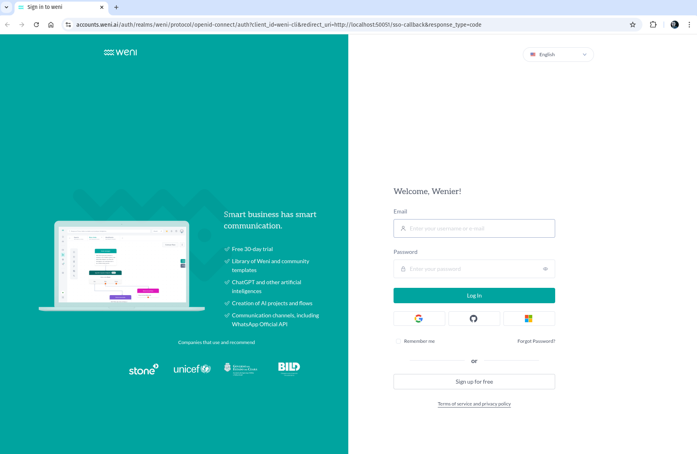

# Authentication Guide

Authentication is one of the most important steps to start developing your agents. To authenticate, you first need to have an account on the Weni platform. You can create your account here: [Weni Platform](https://weni.ai/).

## Authentication Process

Once you have your Weni account, it's time to authenticate using the CLI. Run the following command:

```bash
weni-login
```

This command will open a browser window where you can login with your Weni account.



After logging in, you will be redirected to the CLI and you will be authenticated with a success message.

!!! success start "Login Successfully"
    Now you are authenticated and you can start using the Weni CLI with your projects.