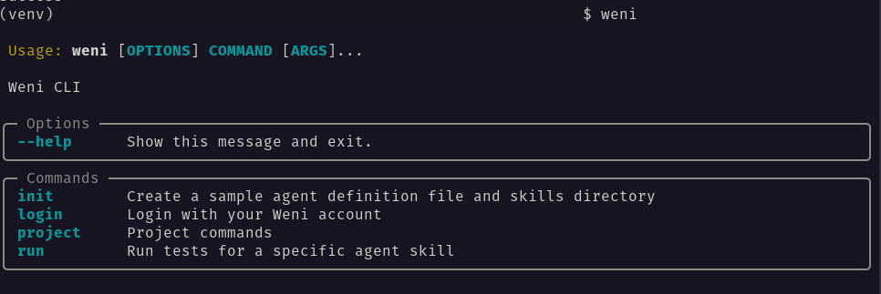

# Installation Guide

This guide will help you install the Weni CLI tool on your system. We provide two installation methods: a quick installation via pip and a manual installation using Poetry for development purposes.

## Requirements

- Python >= 3.10
- Poetry >= 1.8.5

## Installation

### Install via PIP

You can install the CLI directly using pip:

```bash
pip install weni-cli
```

### Manual Installation

1. Clone the repository:
```bash
git clone https://github.com/weni-ai/weni-cli.git
cd weni-cli
```

2. Install dependencies and make the CLI executable:
```bash
poetry shell
poetry install
```

## Verifying Installation

After installation, verify that Weni CLI is properly installed, type the command `weni` in your terminal:

```bash
weni
```

If everything went well, your terminal should display something like this:



## Troubleshooting

If you encounter any issues:

1. Check our [GitHub Issues](https://github.com/weni-ai/weni-cli/issues)
2. Create a new issue with:
   - Your operating system
   - Python version (`python --version`)
   - Error message
   - Steps to reproduce
