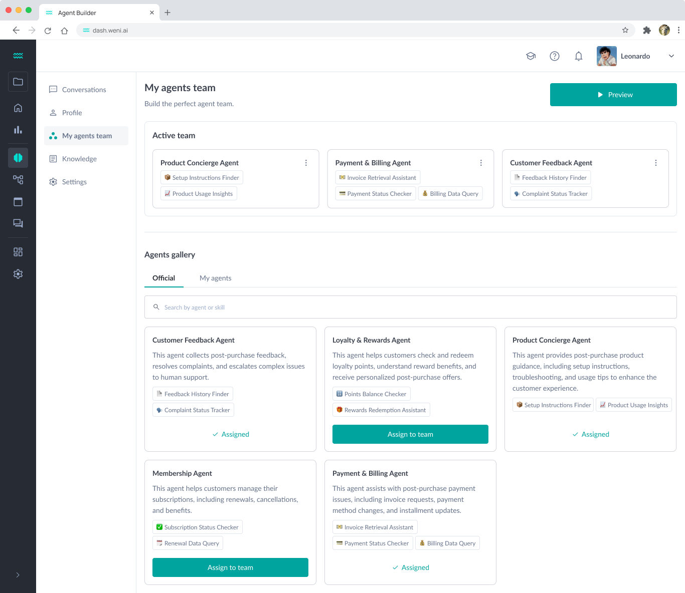

# Welcome to Weni CLI

Weni CLI is a command-line tool that simplifies the creation and management of multiple AI agents quickly and efficiently. Integrated with the Weni platform, it enables the development and deployment of high-performance agents across various communication channels, such as WhatsApp, Instagram, Facebook, and more.

## Overview

With it, you can:

- [x] Create AI agents
- [x] Add custom skills to your agents
- [x] Deploy agents
- [x] Update agent configurations and behaviors
- [x] Manage multiple agents in your projects