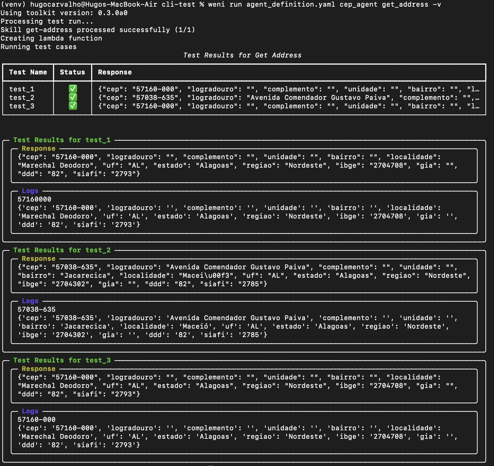

# Tool Run

Tool Run is a scalable way to build your tool and test it in real-time. With this feature, it's simple to debug problems and create a tool that is both scalable and performant at the same time.

## What is required to run a tool?

First, you need to have your tool. If you don't know how to create a tool or still have questions about this subject, you can read the tools page [Tools](../core-concepts/tools.md).

Next, you need to write your test. Let's take the following tool as an example:

```yaml
tools:
  - get_address:
      name: "Get Address"
      source: 
        path: "tools/get_address"
        entrypoint: "main.GetAddressWithAuth"
        path_test: "test.yaml"
      description: "Function to get the address from the postal code"
      parameters:
        - cep:
            description: "postal code of a place"
            type: "string"
            required: true
            contact_field: true
```

Notice that my tool has a specific parameter called "cep". Therefore, the expected input for this tool to be processed is a postal code. This way, I'll create a test file for this tool in the same directory as the specific tool code.

My test file would look something like this:

**test.yaml:**

```yaml
tests:
    test_1:
        parameters:
            cep: "57160000"
    test_2:
        parameters:
            cep: "57038-635"
    test_3:
        parameters:
            cep: "57160-000"
```

Make sure that `path_test` corresponds to the correct path of your tool test.

It's also important to note that if your tool uses any external libraries, you must include a `requirements.txt` file in the same directory as your tool code. This file should list all the dependencies needed for your tool to run properly.

## How to run a test?

Following the previous steps, we can now run a test, but how?

The command works as follows:

```
weni run [agent definition file] [agent name] [tool name]
```

A practical example of the command considering the agent definition that was mentioned above would be:

```
weni run agent_definition.yaml cep_agent get_address
```

Result:


There is also a variation of this command in case you need to include ways to debug the code. You can add the `-v` argument at the end of the command to get more detailed logs of your tool, like this:

```
weni run agent_definition.yaml cep_agent get_address -v
``` 

Result:



## Running Tools That Require Credentials

When your tool needs to interact with external services that require authentication, you'll need to provide credentials during testing. The official method for handling credentials with weni run is using your agent definition and a .env file.

### Using Agent Definition and .env File

This approach mimics how credentials work in production, making your local development environment consistent with deployment.

First, update your agent definition to include credentials:

```yaml
agents:
  cep_agent:
    credentials:
      api_key:
        label: "API Key"
        placeholder: "Api Key"
    name: "CEP Agent"
    description: "Weni's CEP agent"
    instructions:
      - "You are an expert in providing addresses to the user based on a postal code provided by the user"
      - "The user will send a ZIP code (postal code) and you must provide the address corresponding to this code."
    guardrails:
      - "Don't talk about politics, religion or any other sensitive topic. Keep it neutral."
    tools:
      - get_address:
          name: "Get Address"
          source: 
            path: "tools/get_address"
            entrypoint: "main.GetAddressWithAuth"
            path_test: "test.yaml"
          description: "Function to get the address from the postal code"
          parameters:
            - cep:
                description: "postal code of a place"
                type: "string"
                required: true
                contact_field: true
```

Then, create a `.env` file in the root of your project with the actual credential values:

```
api_key=your_actual_api_key_here
```

Now you can run your tool test with credentials using the same command:

```
weni run agent_definition.yaml cep_agent get_address
```

The CLI will automatically pick up the credentials from the `.env` file and make them available to your tool during execution.

### Accessing Credentials in Your Tool Code

Your tool code should access credentials through the `Context` object as shown below:

```python
from weni import Tool
from weni.context import Context
from weni.responses import TextResponse
import requests

class GetAddressWithAuth(Tool):
    def execute(self, context: Context) -> TextResponse:
        # Get parameters from context
        cep = context.parameters.get("cep", "")
        
        # Get credentials from context
        api_key = context.credentials.get("api_key")
        
        address_response = self.get_address_by_cep(cep=cep, api_key=api_key)
        
        return TextResponse(data=address_response)
    
    def get_address_by_cep(self, cep, api_key):
        url = f"https://viacep.com.br/ws/{cep}/json/"
        
        headers = {
            "Authorization": f"Bearer {api_key}"
        }
        
        response = requests.get(url, headers=headers)
        
        return response.json()
```

The key line is `api_key = context.credentials.get("api_key")`, which retrieves the credential value that was defined in your agent definition and stored in your `.env` file.

> **Important**: Never hardcode credentials in your tool code. Always access them through the Context object to ensure your code remains secure and works consistently across different environments.